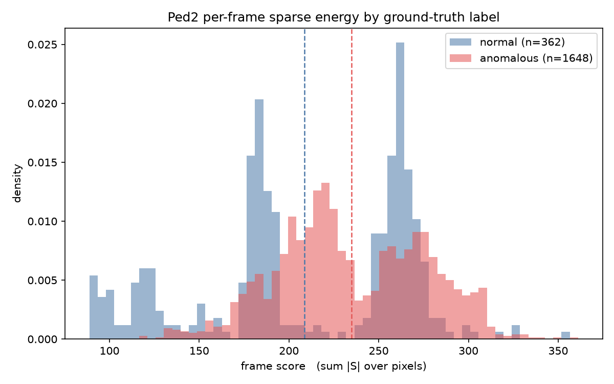
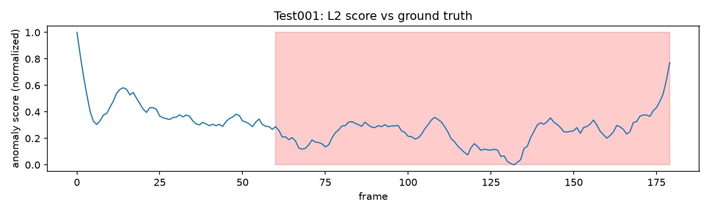
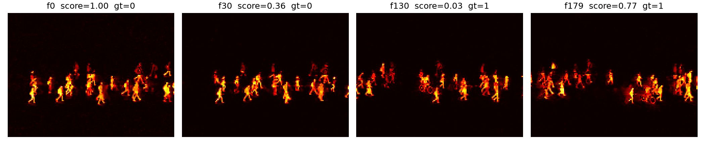

# Robust PCA Video Anomaly Detection

Unsupervised anomaly detection in fixed-camera surveillance video via
low-rank + sparse decomposition (Robust PCA / Principal Component Pursuit),
solved with Inexact Augmented Lagrange Multipliers (IALM).

Each video is stacked as a matrix **X ∈ R^(m×n)** (m = pixels/frame,
n = frames) and decomposed as **X = L + S**, where L is the low-rank
background and S is the sparse foreground. Anomalies are scored per-frame
from the sparse component.

**Dataset:** UCSD Pedestrian (Ped2) — fixed camera, grayscale, ships with
frame-level and pixel-level ground-truth anomaly labels.

## Status

- [X] Session 1 — Repo, data loading, preprocessing, X-matrix construction
- [X] Session 2 — IALM / PCP core (SVT, low-rank + sparse decomposition)
- [X] Session 3 — Detection pipeline (heatmaps, temporal anomaly scores, viz)
- [X] Session 4 — Frame-level evaluation on Ped2 (ROC-AUC, PR-AUC, F1)

## Results (Session 4)

Frame-level evaluation across **all 12 Ped2 test clips** (2010 frames, 1648
anomalous / 362 normal — 82% positive). Score reduction: **total sparse energy
per frame**, `score(t) = Σ|S[:, t]|` (raw, un-normalized). Regenerate with one
command: `python scripts/evaluate_ped2.py`.

| metric | value | baseline | note |
|---|---|---|---|
| ROC-AUC | 0.628 | 0.500 | headline; chance |
| PR-AUC (anomalous = pos) | 0.872 | 0.820 | baseline = prevalence |
| PR-AUC (normal = pos) | 0.417 | 0.180 | minority class |
| F1 (best threshold) | 0.915 | 0.901 | baseline = all-positive |

A weak but genuine signal. ROC-AUC 0.628 is above chance yet far below published
Ped2 methods (0.90+) — expected for vanilla batch RPCA with the crudest possible
reduction (raw sparse magnitude), no spatial or temporal modeling.

The imbalance metrics keep it honest. Ped2 is 82% anomalous, so a trivial
all-positive predictor already scores F1 0.901 and PR-AUC 0.820; the detector
beats those by only **+0.014** and **+0.052**. The informative number is
minority-class PR-AUC — **0.417 vs 0.180** baseline (~2.3×) — so raw energy
separates *normal* (low-energy) frames far better than it flags anomalies.
Anomalous frames do carry more sparse energy (Cohen's d = +0.589), but with
0.441 distribution overlap it is a poor separator, and the pooled ROC-AUC is
partly cross-clip energy differences (4 clips are 100% anomalous).

This resolves the Session 3 open question below: the Test001 ROC-AUC inversion
(0.122) was **clip-specific, not a property of the method** — pooled across all
twelve clips with raw L1 energy, the direction is correct.



## Results (Session 3)

Frame-level scoring on Test001: L2 norm of each column of S.

| metric | value | baseline |
|---|---|---|
| ROC-AUC | 0.122 | 0.500 |
| PR-AUC | 0.484 | 0.667 |

Below chance in both. The score ranks anomalous frames below normal ones, and raw norms span only 7.19 to 8.64 against a mean of 7.62, so the detector has almost no dynamic range. Min-max normalization stretches that thin band across the full axis, which makes the plot look more separated than the underlying scores are.

Foreground pixel count correlates with score at only 0.318, so this is not
simply crowd density. Measured on one clip; whether the inversion is a
property of the method or specific to Test001 is open until all twelve
test clips are scored.




## Setup

```bash
python -m venv .venv && source .venv/bin/activate
pip install -r requirements.txt
bash scripts/download_ucsd.sh   # ~700MB, extracts to data/
pip install -e .

# Session-4 evaluation (offline / batch — nothing real-time):
python scripts/build_labels.py          # Step 1: labels + alignment proof
python scripts/score_and_histograms.py  # Step 2: Σ|S| scores + split histograms
python scripts/evaluate_ped2.py         # Step 3: ROC-AUC / PR-AUC / F1 table
```

The first scoring run decomposes all 12 test clips with IALM (a few minutes)
and caches `outputs/<clip>.npz`; later runs reuse the cache.

## Layout

```
src/rpca_anomaly/
  data/       # Ped2 loading, preprocessing, frame->matrix construction
  rpca/       # IALM solver, singular value thresholding   (Session 2)
  detection/  # anomaly scoring, thresholding               (Session 3)
  viz/        # 4-panel demo, heatmaps, score plots         (Session 3)
scripts/      # dataset download, run entrypoints
notebooks/    # exploration only — logic lives in src/
data/         # gitignored; see data/README.md
```
